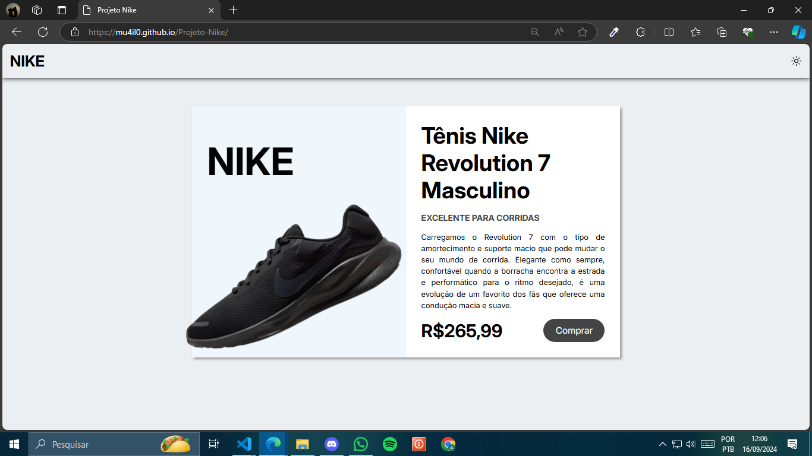
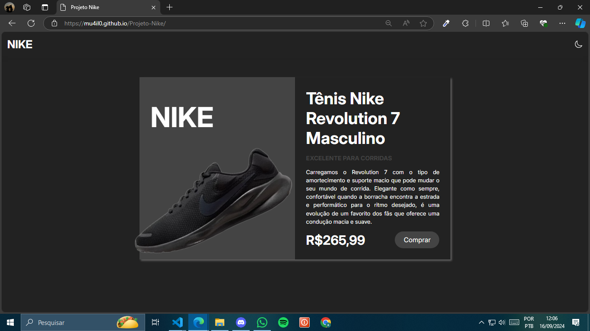

# Projeto-Nike

<h1>Projeto Nike - Página Interativa </h1>
Este é um projeto de página interativa para o tênis Nike Revolution 7, utilizando HTML5, CSS3 e JavaScript. O foco está em criar uma interface moderna com animações e um modo escuro/claro, proporcionando uma melhor experiência de usuário.

<h2>🛠 Tecnologias Utilizadas</h2>
<h3>HTML5: </h3> Estrutura da página.
<h3>CSS3: </h3> Estilização, animações e layout.
<h3>JavaScript: </h3> Funcionalidades interativas, como a troca de tema.

<h2>🔍 Funcionalidades </h2>
<h3>Animação do Tênis: </h3> O tênis é carregado com uma animação em que ele gira suavemente, destacando o produto de forma elegante.
<h3>Modo Claro/Escuro: </h3> Implementado com JavaScript, o usuário pode alternar entre os temas com um clique em um ícone de sol ou lua.
<h3>Design Minimalista: </h3> O layout é limpo e com foco no produto, destacando o tênis com cores neutras e tipografia clara.

Minhas redes sociais:

